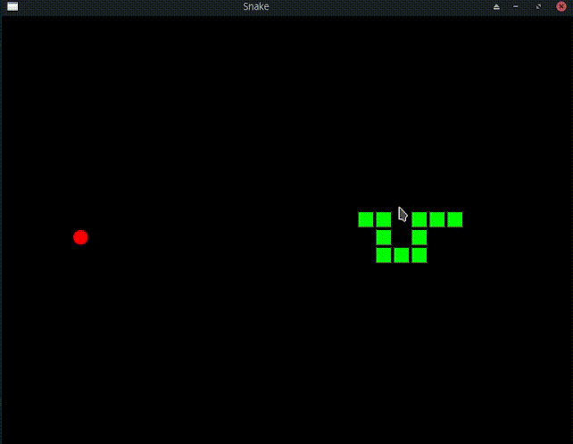

# ViperEngineLibs
 Open source Viper engine for Game Design ------------> Snake Game Demo

 

 This is not a comercial engine

 This version does not include interop with python

 What I am intending to do, is only use SFML for the window handling, key presses, and drawing. 

 I want to avoid using std::vector, or std::list. Basically, I am trying to do things the hard way, 
 for the sake of learning. I do not suggest anyone use this Framework as an 'Engine' to make a game, 
 rather, I challenge you to look into not relying on libaray's just because it is easy. Try to grow,
 make some mistakes, and enjoy the journey. 

Install SFML version 2.61
Install cmake/g++

run make 
in the same folder as all the header files, and main.cpp/Montserrat.cpp

In linux, run ./Snake

in windows? idk, i'm not on windows atm :P on a serious note, likely works if ran in windows

 
